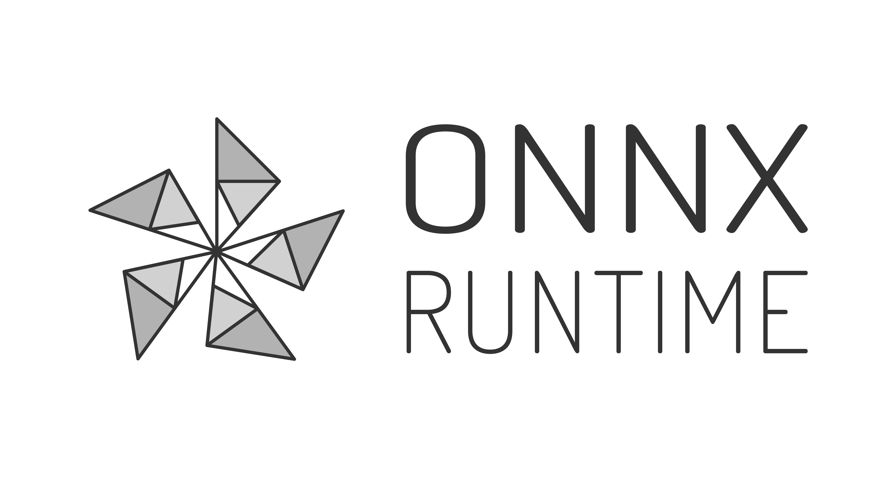

# ONNX Runtime Vendor Package for ROS2

<p align="center"></p>

[ONNX Runtime](https://github.com/microsoft/onnxruntime) is an open source inference engine for ONNX Models.
ONNX Runtime Execution Providers (EPs) enables the execution of any ONNX model using a single set of inference APIs that provide access to the best hardware acceleration available.

The `onnxruntime_vendor` package, specifically designed for ROS2, provides a convenient way to download and extract the appropriate version of the ONNX Runtime library for use in your project.

## System Requirement

To make use of the hardware acceleration, the system is required to be compatible with CUDA and cuDNN. Please refer to the following table for the supported versions by this package:

| ONNX Runtime Version  | CUDA Version | cuDNN | Distribution (recommended) |
| ------------- | ------------- | ------------- |------------- |
| 1.4.0  | 10.1  | 7.6.5 | Ubuntu 18.04 LTS |
| 1.6.0  | 10.2  | 8.0.3 | Ubuntu 20.04 LTS |
| 1.12.1  | 11.4  | 8.2.4 | Ubuntu 20.04 LTS |
| 1.14.1  | 11.6  | 8.2.4 | Ubuntu 20.04 LTS |
| 1.15.0  | 11.8  | 8.9.1 | Ubuntu 22.04 LTS |

> [1]: [ONNX Runtime requirements](https://onnxruntime.ai/docs/execution-providers/CUDA-ExecutionProvider.html#requirements), [2]: [CUDA Support Matrix](https://docs.nvidia.com/deeplearning/cudnn/support-matrix/index.html#cudnn-cuda-hardware-versions)
<br> For GPU support, please follow the installation steps on NVIDIA portal before proceeding.

## How to Build
### Ubuntu (without CUDA support)

```Batchfile
mkdir colcon_ws/src
cd colcon_ws

colcon build --packages-select onnxruntime_vendor --cmake-args -DCUDA_SUPPORT=OFF -DONNXRUNTIME_VERSION=<version>

```

### Ubuntu (with CUDA support)

```Batchfile
mkdir colcon_ws/src
cd colcon_ws

colcon build --packages-select onnxruntime_vendor --cmake-args -DCUDA_SUPPORT=ON -DONNXRUNTIME_VERSION=<version>

```

## License
The onnxruntime_vendor package is licensed under the MIT License. However, the ONNX Runtime library that it downloads is licensed under its own terms. Please refer to the ONNX Runtime license for more information.

## Contributing
Contributions to the onnxruntime_vendor package are welcome. Please submit a pull request or open an issue on our GitHub page.

## Acknowledgements
The onnxruntime_vendor package is based on the ONNX Runtime library developed by Microsoft Corporation.

> See original repository for more information:
[ros_msft_onnx](https://github.com/ms-iot/ros_msft_onnx)